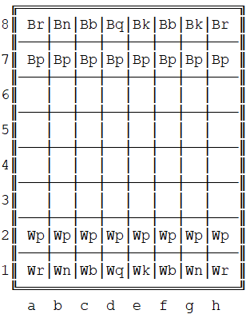

# Chess Game
 > Authors: [Andrew Chen](https://github.com/andrewrchen05), [Wyatt Bowen](https://github.com/wyatt-bowen), [Yunjie Fang](https://github.com/jessiefang)

## Project Description
 
 ### What Our Project Is
 
 > For our final project in CS100, we will be implementing a chess game. Our chess game will be a traditional 2 player chess game capable of saving games, undoing moves and playing with a computer. We chose this game because this project will be a challenge: chess is a game with countless possibilities. As a result, we will need to build a robust software architecture and leverage the appropriate software design patterns to implement our program. 
 
 ### General Implementation
 
 > We will be implementing this program in the command line using C++. Testing technologies may include TravisCI for integration tests and CMake for unit tests. This will ensure that our input and output runs smoothly in our program. The users will be asked to make their choices from a menu or to move a chesspiece, and our program will execute them. Unit tests will ensure that this input, whether it be in the form of an integer, string or other, is correctly used by functions' intra and inter-dependencies. The same will be required when the program needs to notify the user of the output, whether it be in on-screen notifications verifying a viable move or displaying the chessboard.

 > When the board is displayed it will look something like this.

   
 
 > Features such as keeping track of moves by both players is straighforward enough. For more advanced features such as playing with computer, it is possible we may have to rely on the help of outside libraries or APIs that can analyze the position of pieces on a chessboard and make a decision. We can then use this decision to move a piece on our board. 
 
 ### Design Patterns
 
 > Our chessboard will be a 2-dimensional board with 64 squares. When the game starts, every player will begin with 16 pieces at the starting position. Users will be able to select a chess piece and attempt to move to a certain position. Our program will determine if the move perpetrated by a player is a valid move, and if there are consequences associated with the move such as capture of a chesspiece, checkmate and so on. Below is a summary of the design patterns we will be using in our program.

 
 #### Composite Pattern
 
 > Problem: Our chessboard is going to be populated with many chesspieces with different kinds of behaviors. The chess pieces have mainly the same features such as move but different behaviours for the features. Solution: The strategy pattern allows recognition of the type of piece a Chesspiece object is and carries out the appropriate behavior based on the object's move() function. All chess pieces will inherit from a base class. The design pattern can simply define all pieces' features in a pattern and implement differently acccroding to their behaviours. According to the type of chess piece, pieces will be limited in moving diagonally, forward, back, sidways, L-shaped or the amount of squares it can traverse. This runtime determination will allow us to reuse code and thus create a more flexible program. Our chessboard will be implemented via a 2d array using Chesspiece objects and the composite pattern will allow us to move pieces around the board while determining the type and move behavior at runtime.
 
 #### Abstract factory Pattern
 
 > Problem: We need to declare all of the pieces on the board with all of the necessary properties. We must ensure that each piece has a location, along with other data. Solution: The abstract factory pattern allows us to initialize the various pieces on the board at game start. This design pattern will guarantee that we create each piece object with all of its necessary data. There are 6 unique pieces in chess, and there are multiple instances of each type of piece at game start. The PieceCreator class is an internal function that generates pieces based on the identifier used, such as "rook", "pawn", "knight", etc. This isued in the process of initializing the chessboard.

 > ## Phase II
 > In addition to completing the "Class Diagram" section below, you will need to 
 > * Set up your GitHub project board as a Kanban board for the project. It should have columns that map roughly to 
 >   * Backlog, TODO, In progress, In testing, Done
 >   * You can change these or add more if you'd like, but we should be able to identify at least these.
 > * There is no requirement for automation in the project board but feel free to explore those options.
 > * Create an "Epic" (note) for each feature and each design pattern and assign them to the appropriate team member. Place these in the `Backlog` column
 > * Complete your first *sprint planning* meeting to plan out the next 7 days of work.
 >   * Create smaller development tasks as issues and assign them to team members. Place these in the `Backlog` column.
 >   * These cards should represent roughly 7 days worth of development time for your team, taking you until your first meeting with the TA
## Class Diagram
 
 
 > Piece is a virtual class inherited by all of the individual pieces, pawn, rook, knight, bishop, queen, and king. Piece uses a Position data structure to store its row and column number. Player is a class that White and Black inherit from. The Player class is the class we use to handle how people interatct with the game state (ChessboardMenu). Towards the top of the diagram we outline an abstract factory. ChessboardMenu uses the PieceCreator class, which is inherited from by one factory for each piece. The RookFactory creates an object of the Rook type.

 > ## Final deliverable
 > All group members will give a demo to the TA during lab time. The TA will check the demo and the project GitHub repository and ask a few questions to all the team members. 
 > Before the demo, you should do the following:
 > * Complete the sections below (i.e. Screenshots, Installation/Usage, Testing)
 > * Plan one more sprint (that you will not necessarily complete before the end of the quarter). Your In-progress and In-testing columns should be empty (you are not doing more work currently) but your TODO column should have a full sprint plan in it as you have done before. This should include any known bugs (there should be some) or new features you would like to add. These should appear as issues/cards on your Kanban board. 
 
 ## Screenshots
  
  Start Menu  
  
  Starting a saved game  
   
  Invalid move input  
   
  Showing move before confirmation  
   
  Undo Move  
   
  Successful Move hands turn to next player  
   
  Capturing an opponent's piece  
   
  Piece in Check  
   
  Attempting to move while in check  
  
 
 ## Installation/Usage
 1. Run cmake3 .
 2. Run make
 3. Run the ./chess executable
 4. Choose whether to start a new game or load a saved game or start a saved game in slots 1-3.
 5. Move pieces based on where the piece is currently at, and where on the board you would like to move to to. For example, 'e1 e2' moves the piece in e1 to e2. Make sure there is a space between the piece coordinates.
 6. Enter 'exit' to save the game, 'save' to save the game in slots 1-3.
 ## Testing
 Our program was validated by unit testing using CMake and Googletest. Our unit tests test individual functions as well as how different components work together. We have tested the following major items in our program: 
 1. Making sure that Pieces are only allowed to move to valid places on the board. That is, a Piece cannot capture a member of its own team and it cannot choose an in
 2. Testing individual functions to make sure they can be relied upon internally
 3. Testing the interface manually to fine-tune the look and feel of the application.
 
